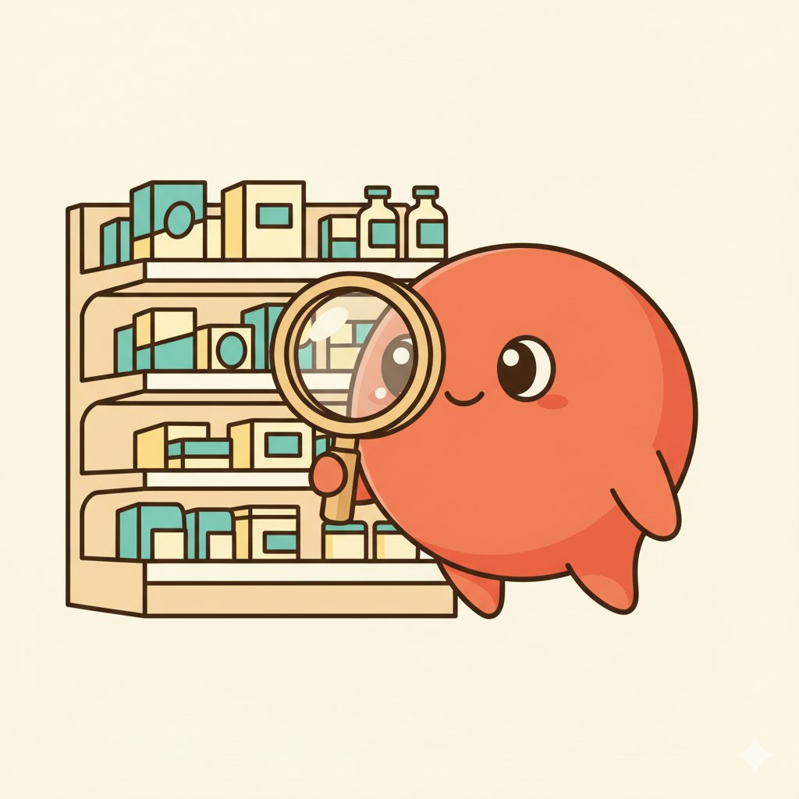

# 🛒 Elsie — AI Grocery Coach

<div align="center">

[](https://geminiliveagentchallenge.devpost.com/)

**Real-time AI that reads your lab report, watches grocery shelves through your camera, and tells you what to grab — as naturally as asking a friend standing next to you.**

[](https://elsie-grocery-coach-29072207619.us-central1.run.app)
[](https://geminiliveagentchallenge.devpost.com/)
[](https://ai.google.dev/)
[](https://cloud.google.com/run)


*Meet Elsie — your witty, warm, and health-savvy grocery buddy.*

</div>

---

## 👁️ See · 👂 Hear · 🗣️ Speak

The hackathon asked: *"Can your agent see, hear, and speak?"* Elsie does all three:

| Capability | How Elsie Does It |
|-----------|------------------|
| **👁️ SEE** | Camera streams frames every 3 seconds to Gemini Live API. Gemini identifies products by name, brand, and reads nutrition labels — packaged goods AND fresh produce. |
| **👂 HEAR** | Continuous speech recognition via iOS SpeechRecognition. Always listening — no button tap needed. Barge-in support: start speaking and Elsie stops mid-sentence. |
| **🗣️ SPEAK** | iOS speechSynthesis reads Elsie's evaluations aloud. Hands-free while you push the cart. Personalized greeting based on your conditions. |

---

## 🎭 Elsie's Persona


Elsie isn't a generic chatbot. She has a distinct personality:

- **Warm and playful** — "Ooh, jackpot! That salmon is an omega-3 goldmine!"
- **Clever food puns** — "That cereal has more sugar than a birthday cake wearing a lab coat!"
- **Never judgmental** — gently redirects with humor, never shames
- **Quick** — 2-3 sentences max, because grocery aisles move fast
- **Fun food facts** — "Fun fact: that avocado has more potassium than a banana!"
- **Allergen alerts are urgent** — "Whoa, hold up! That's got peanuts. Put that one back, friend."

---

## 🔴 The Problem


More than half of all U.S. adults — over 130 million people — live with at least one preventable chronic condition linked to diet ([2025 Dietary Guidelines Advisory Committee Report, USDA/HHS](https://www.dietaryguidelines.gov/2025-advisory-committee-report)). We call them **diet-sensitive conditions**:

| Condition | Americans Affected | Must Monitor |
|-----------|-------------------|-------------|
| Diabetes & pre-diabetes | 40.1M + 115.2M pre-diabetic ([CDC, Jan 2026](https://www.cdc.gov/diabetes/php/data-research/index.html)) | Sugars, carbs, glycemic load |
| Hypertension | 119.9M — nearly 1 in 2 ([CDC, Jan 2025](https://www.cdc.gov/high-blood-pressure/data-research/facts-stats/index.html)) | Sodium, often below 1,500mg/day |
| High cholesterol | 86M above 200 mg/dL ([CDC, Oct 2024](https://www.cdc.gov/cholesterol/data-research/facts-stats/index.html)) | Saturated fats, dietary cholesterol |
| Chronic kidney disease | 37M — 1 in 7 ([CDC, Jan 2026](https://www.cdc.gov/diabetes/php/data-research/index.html)) | Phosphorus, potassium, sodium |
| Food allergies | 33M Americans ([FARE](https://www.foodallergy.org/resources/facts-and-statistics)) | Hidden allergens — life-threatening |
| Celiac disease | ~3M Americans ([Celiac Disease Foundation](https://celiac.org/about-celiac-disease/what-is-celiac-disease/)) | Every trace of gluten |

Diet-related chronic disease accounts for over half of U.S. deaths and costs the healthcare system over $1 trillion annually ([U.S. GAO Report GAO-21-593](https://www.gao.gov/products/gao-21-593)).

The nutrition app market is valued at $5.8B in 2025 growing at 12% CAGR ([Mordor Intelligence](https://www.mordorintelligence.com/industry-reports/diet-and-nutrition-apps-market)). The chronic-disease patient segment grows at 14.4% CAGR — exactly who Elsie serves. The broader personalized nutrition market is projected to double to $30.9B by 2030 ([MarketsandMarkets](https://www.marketsandmarkets.com/Market-Reports/personalized-nutrition-market-249208030.html)).

Every one of these people gets the same advice: **"Watch what you eat."** Then they walk into a grocery store with 40,000 products and zero guidance.

---

## 📊 Why Existing Solutions Fail


| Solution | How It Works | Friction | Fresh Produce? | Personalized to Lab Values? |
|----------|-------------|---------|---------------|---------------------------|
| MyFitnessPal | Manual log / barcode | High — type or scan each | ❌ | ❌ |
| Fooducate | Barcode + A-D grade | Medium — scan, read, repeat | ❌ | ❌ |
| Yazio / Lifesum | Meal plans + logging | High — post-purchase | ❌ | ❌ |
| ChatGPT / Gemini | Photo upload + type | High — 6 steps per product | ✅ but manual | Only if you describe conditions |
| Dietitian | Office visit advice | N/A — not at the store | General only | ✅ but not real-time |
| **Elsie** | **Point camera + speak** | **Zero — just talk** | **✅** | **✅ Your actual lab values** |

---

## 💡 What Elsie Does


Elsie fills that gap by being the knowledgeable friend who shops with you — one who's already read your lab report.

Before your first trip, you upload your lab report (PDF or photo). Gemini reads the entire document and extracts **every** health marker it finds — blood sugar, cholesterol, iron, vitamins, thyroid, liver function, kidney markers, everything. The report is immediately deleted. Only the numbers stay. Now Elsie knows you personally — not just "diabetic," but "A1c at 7.2, LDL at 145, iron at 38, vitamin D low."

Then you put in your earbuds (or not!), open Elsie, and start shopping. Your camera watches the shelves. When you want to know about a product, you just ask — out loud, naturally, like talking to a friend next to you: "Hey, can I buy this?" and within 2-3 seconds, Elsie sees the product (front or back side), identifies it by name and brand, evaluates it against your specific health markers, and responds with a clear verdict, spoken aloud so your hands stay free for the cart.

**No barcode scanning. No typing. No switching apps. No uploading photos. JUST POINT AND ASK!**

Unlike barcode apps, Elsie sees everything — packaged goods, fresh produce, bakery items, deli meats. Point at a bunch of spinach and Elsie knows your iron is low: *"Ooh, grab that spinach! Your iron is on the low side and spinach is packed with it. Pro tip: pair it with something citrusy — vitamin C helps your body absorb the iron better!"*



---

## ✨ Key Features


- **🧬 Extract ALL lab markers** — Upload once. Gemini reads the entire report: blood counts, vitamins, minerals, hormones, liver, kidney, thyroid, cholesterol, metabolic panel — everything. Report immediately deleted. Top 7 markers display color-coded (🟢 normal / 🟡 borderline / 🔴 abnormal) with ▲▼ arrows. Tap to expand full list in a popup.
- **🏥 12 health conditions** — Diabetes, pre-diabetes, high cholesterol, hypertension, kidney disease, pregnancy, celiac, vegetarian, vegan, dairy-free, nut allergy, heart health.
- **🥦 Works on ALL products** — Packaged goods, fresh produce, bakery, deli, bulk bins. No barcode needed.
- **🎤 Continuous voice** — Always listening. No button tap. Just talk naturally.
- **✋ Barge-in** — Start speaking and Elsie stops mid-sentence to listen.
- **⏰ Silence nudge** — After 60 seconds of quiet: "Which product would you like to know about next?"
- **👋 Personalized greeting** — "I'll keep a special eye on sugars and carbs for you!"
- **🌍 Works at any store, any country** — No partnerships needed.

---

## 🏗️ Architecture


```
┌──────────────────────────────────────┐
│       Your iPhone (Safari)            │
│  Camera + Voice In + Voice Out        │
└──────┬──────────────┬────────────────┘
       │              │
  WebSocket      POST /api/ask
  (video frames   (photo + question
   every 3 sec)    when you ask)
       │              │
┌──────▼──────────────▼────────────────┐
│     Google Cloud Run (FastAPI)         │
│           Elsie's Backend              │
├───────────┬────────────┬─────────────┤
│  Vision   │  Product   │  Report     │
│  Stream   │  Evaluator │  Reader     │
│ (Live API)│ (Flash)    │ (Flash)     │
└─────┬─────┴─────┬──────┴──────┬──────┘
      │           │             │
      ▼           ▼             ▼
┌──────────┐ ┌──────────┐ ┌──────────┐
│ Gemini   │ │ Gemini   │ │Firestore │
│ Live API │ │ Flash    │ │(profiles)│
│ (watches │ │(evaluates│ │          │
│  camera) │ │ product) │ │          │
└──────────┘ └────┬─────┘ └──────────┘
                  │
        ┌─────────┼─────────┐
        ▼         ▼         ▼
   ┌────────┐┌────────┐┌────────┐
   │  USDA  ││  Open  ││ Camera │
   │FoodData││  Food  ││ Label  │
   │Central ││ Facts  ││  OCR   │
   └────────┘└────────┘└────────┘
```

**Why hybrid?** The Gemini Live API maintains continuous visual awareness — Gemini is always watching your camera. When you ask a question, the current frame + your question + your health profile are sent to Gemini Flash via `generate_content` for a reliable evaluation. The Live API excels at streaming context; `generate_content` excels at consistent, accurate responses. For the critical task of health-based product evaluation — reliability wins. Both paths use the Google GenAI SDK.

---

## 🔬 How Elsie Evaluates Products


| Layer | Source | What It Does |
|-------|--------|-------------|
| **Layer 1** | Camera (Gemini Vision) | Identifies product name, brand, reads visible nutrition label |
| **Layer 2** | Your health profile (Firestore) | Every marker from your lab report + selected conditions + allergies |
| **Layer 3** | USDA FoodData Central + Open Food Facts | Detailed nutrition data for 4M+ branded products worldwide |
| **Layer 4** | Direct label reading (Gemini OCR) | Reads nutrition facts panel from camera if product isn't in databases |

Elsie never fails — even for store-brand or brand-new products, she reads the label directly.

---

## 🛠️ Tech Stack


| Component | Technology | Purpose |
|-----------|-----------|---------|
| AI Model | Gemini 2.0 Flash (Live API + generate_content) | Multimodal: sees images, understands text |
| SDK | Google GenAI SDK (Python) `>=1.5.0` | Official Gemini toolkit |
| Server | Google Cloud Run | Auto-scales, pay-per-use |
| Database | Google Cloud Firestore | Health profile persistence |
| Backend | FastAPI (Python 3.12) | Async, fast, WebSocket support |
| Voice Input | iOS SpeechRecognition API | Built into iPhone, continuous listening |
| Voice Output | iOS speechSynthesis API | Built into iPhone, hands-free |
| Nutrition | USDA FoodData Central | U.S. government database, updated monthly |
| Nutrition | Open Food Facts | 4M+ products, 150 countries |
| Deployment | Automated via `deploy.sh` | One command deploys everything |

---

## 🚀 Local Development


### Prerequisites

- Python 3.12+
- Google Cloud account with billing enabled
- `gcloud` CLI installed and authenticated
- A GCP project with Firestore and Vertex AI APIs enabled

### Setup

```bash
# Clone the repository
git clone https://github.com/priyanayyar27/elsie-grocery-coach.git
cd elsie-grocery-coach

# Set your GCP project
gcloud config set project YOUR_PROJECT_ID

# Enable required APIs
gcloud services enable aiplatform.googleapis.com firestore.googleapis.com run.googleapis.com

# Create Firestore database (if not exists)
gcloud firestore databases create --location=us-east1

# Install dependencies
pip install -r requirements.txt

# Run locally
python main.py
```

Open `http://localhost:8080` in Safari (voice features require HTTPS in production).

### Deploy to Cloud Run

```bash
chmod +x deploy.sh
./deploy.sh
```

The deploy script builds the Docker image, pushes to Google Container Registry, and deploys to Cloud Run — all in one command.

### Environment Variables

| Variable | Default | Description |
|----------|---------|-------------|
| `GOOGLE_CLOUD_PROJECT` | `elsie-grocery-coach` | Your GCP Project ID |
| `USDA_API_KEY` | `DEMO_KEY` | USDA FoodData Central API key ([get one free](https://fdc.nal.usda.gov/api-key-signup.html)) |

---

## 📚 What I Learned


1. **Reliability beats purity.** The hybrid approach (Live API for vision + generate_content for evaluation) proved far more reliable than routing everything through a single streaming session. The best architecture is whatever delivers a working product.

2. **Don't limit the AI.** My first extraction prompt asked for 7 specific markers. When I changed it to "extract everything you find," Gemini pulled 30+ values from a single report. Tell Gemini what you want, not what you think it can do.

3. **Fresh produce is the blind spot.** Every competitor relies on barcodes. Half the grocery store has no barcodes. Gemini Vision identifies products visually — making Elsie the only solution that works for the entire store.

4. **Building for iPhone Safari is a project within a project.** AudioContext restrictions, SpeechRecognition auto-restart patterns, and speechSynthesis timing quirks shaped the final architecture significantly.

5. **Design for the aisle, not the desk.** Every UX decision was tested against one question: would this work while pushing a cart with one hand and holding a product with the other? That constraint led to continuous voice, barge-in, and hands-free operation as core features — not nice-to-haves.

---

## 🗺️ Future Roadmap


**Phase 1 — Deepen the core (0-3 months)**
Native iOS/Android app with Gemini audio streaming. Barcode scanning as secondary input alongside camera vision. Shopping list integration with healthier alternative suggestions.

**Phase 2 — Expand the audience (3-6 months)**
Multi-language support starting with Spanish (60M+ U.S. speakers). Family profiles — one household, multiple health profiles, one grocery trip. Wearable support via Meta smart glasses and Apple Watch.

**Phase 3 — Build the ecosystem (6-12 months)**
Grocery store API integration for real-time pricing and aisle location. Health system partnerships for post-diagnosis dietary support. Anonymized dietary trend data for public health research. Meal planning engine personalized to health profiles.

---

## 🔒 Privacy


- Lab reports are processed in memory and **immediately deleted** — only extracted key-value markers are stored
- No personal identifying information is saved
- Camera frames are processed in real-time and **never saved**
- Health data stored in Google Cloud Firestore with encryption at rest
- Elsie provides general wellness and nutrition information, **not medical advice**

---

## 📖 Technical Glossary

| Term | What It Means |
|------|--------------|
| **Gemini Live API** | Google's real-time AI model that maintains a persistent session — it continuously watches camera frames and can respond to voice/text in real-time via WebSocket |
| **Gemini Flash** | Google's fast AI model for one-shot tasks — given an image + text prompt, it returns a single response. Used for reliable product evaluation |
| **generate_content** | The API method that sends a single request (image + text) to Gemini and receives a single response. Simpler and more reliable than streaming |
| **WebSocket** | A persistent two-way connection between the phone and server. Unlike a regular API call (request → response), a WebSocket stays open — camera frames flow continuously without reconnecting each time |
| **Cloud Run** | Google's serverless container platform. You give it your code in a Docker container, and it runs it on Google's servers. Auto-scales from 0 to thousands of users. You pay only when code is running |
| **Firestore** | Google's cloud NoSQL database. Stores user health profiles as simple key-value documents. Encrypted at rest. Fast reads for real-time lookups |
| **FastAPI** | A modern Python web framework for building APIs. Supports async operations and WebSockets natively — both critical for Elsie's real-time architecture |
| **SpeechRecognition API** | A browser API built into Safari that converts spoken words into text. Runs on-device (iPhone), not on our server |
| **speechSynthesis API** | A browser API built into Safari that converts text into spoken audio. Uses the iPhone's built-in Siri voices |
| **Barge-in** | The ability to interrupt the AI while it's speaking. When the user starts talking, Elsie's speech is immediately cancelled so she can listen |
| **USDA FoodData Central** | The U.S. government's official food and nutrition database, maintained by the Department of Agriculture. Updated monthly with nutrition data for branded and generic foods |
| **Open Food Facts** | An open-source, community-maintained database of food products from around the world. Contains over 4 million products across 150 countries |
| **OCR (Optical Character Recognition)** | The ability to read text from an image. Gemini uses OCR to read nutrition labels directly from camera frames when a product isn't found in external databases |
| **Health markers** | Measurable values from a blood test or lab report — e.g., A1c (blood sugar control), LDL (bad cholesterol), HDL (good cholesterol), iron, vitamin D, TSH (thyroid). Elsie extracts ALL markers from your report |
| **CAGR** | Compound Annual Growth Rate — the rate at which a market grows each year, compounded. A 12% CAGR means the market grows ~12% per year |

---

## ⚖️ Disclaimer

Elsie provides general wellness and nutrition information, not medical advice. Always follow your doctor's guidance. Elsie is a dietary preference tool, not a medical device.

---

## 👩‍💻 Author

**Priyanka Nayyar** — [GitHub](https://github.com/priyanayyar27) · [GDG Profile](https://gdg.community.dev/)


Built with Google Gemini, Google Cloud, and Google GenAI SDK.
